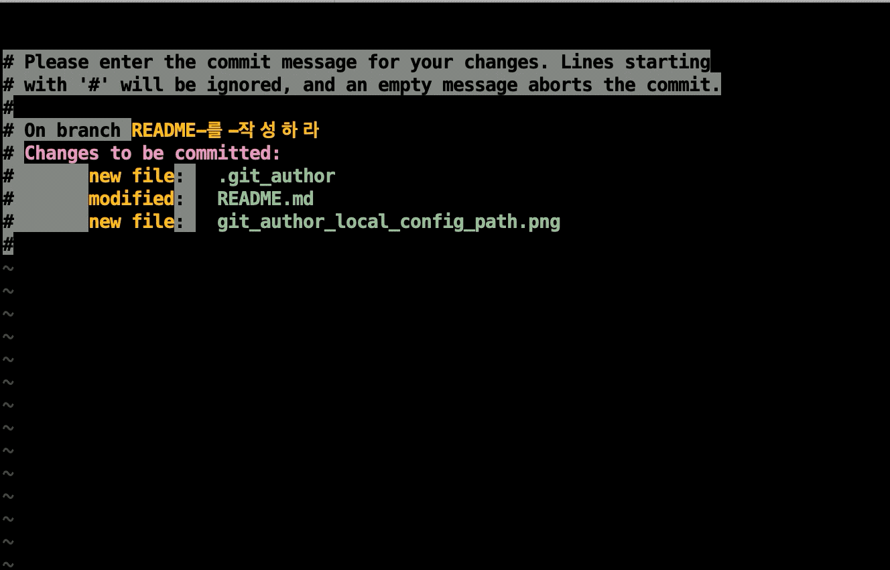
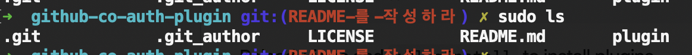

# Vim GitHub Co Author Plugin


## Installation
Using [vim-plug](https://github.com/junegunn/vim-plug)
``` vimscript
Plug 'jehuipark/github-co-author-vim-plugin'
```

## Use Guide

### Co-Author complete shortcut key
when insert mode in vi

`ctrl` + `l`

### Global Config
**Co Author Global Management File Path**
``` vim
let g:github_co_author_list_path = '~/.vim/github-co-author-list'
```

### Local Config
**Co Author Local Management File Path**

`{git_work_space}/.git_author`



### Co Author Management File Format
```
Alice <alice@example.com>
Bob <bob@example.com>
Charlie <charlie@example.com>
```

You can add authors from a github project using the output from `git shortlog -s -n -e` to the respective file:

```shell
# Local config
git shortlog -s -n -e | cut -c8- > .git_author

# Global config
git shortlog -s -n -e | cut -c8- > ~/.vim/github-co-author-list
```

### Auto Complete Flow
1. keymap
1. hasLocal? return : next
1. hasGlobal? return : next
1. fallback return
    > fallback message: `Co-Authored-By: name <email>`
